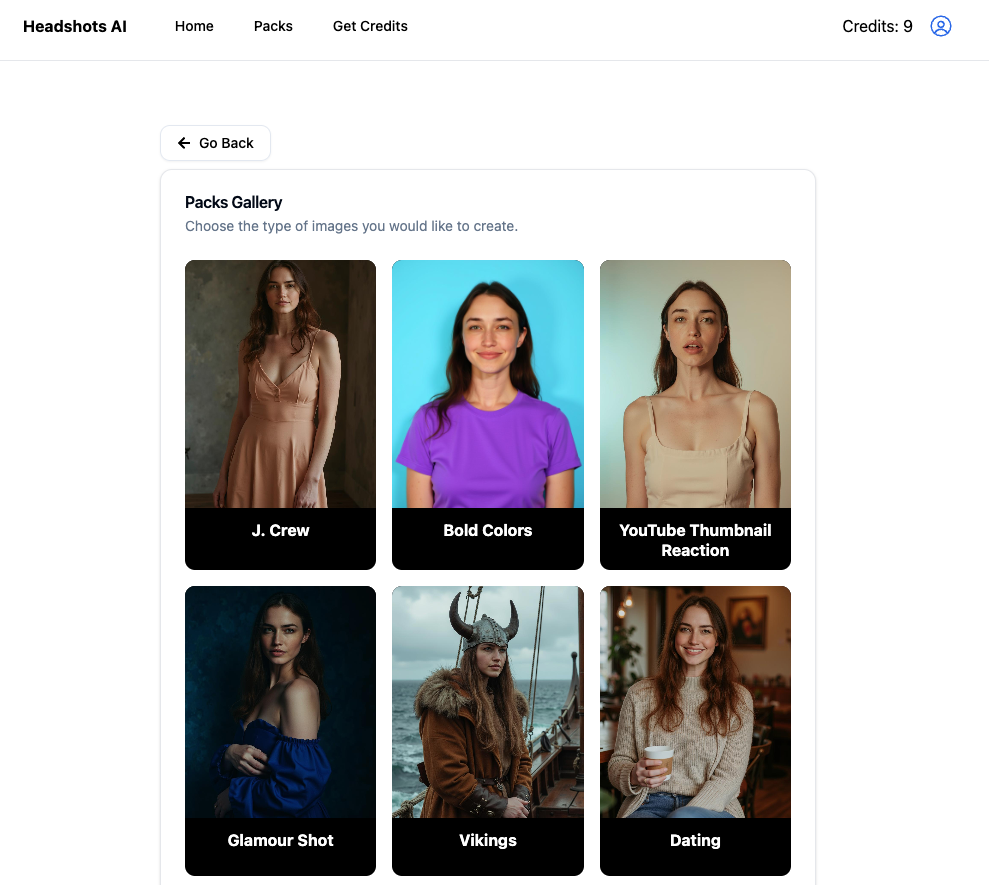

# 🚩【当前为最新定稿版 | Latest Final Version】

> 本 README.md 已根据实际代码和功能核查，所有核心功能、环境变量、免费试用与 Stripe 支付等重要事项均已记录。如有后续调整请以本版为准。

# 👨‍💼 [Headshot AI](https://headshots-starter.vercel.app/) - Professional Headshots with AI (powered by Astria.ai)

Introducing Headshot AI, an open-source project from [Astria](https://www.astria.ai/) that generates Professional AI Headshots in minutes.

This project was built to give developers & makers a great starting point into building AI applications. This is your launch pad - fork the code, modify it, and make it your own to build a popular AI SaaS app.

[](https://vercel.com/new/clone?repository-url=https%3A%2F%2Fgithub.com%2Fleap-ai%2Fheadshots-starter%2Ftree%2Fmain&env=ASTRIA_API_KEY,APP_WEBHOOK_SECRET&envDescription=Set%20up%20environment%20variables%20for%20Leap%20AI%20and%20redirect%20URL%20in%20Supabase%20Auth%20dashboard.%20See%20.env.local.example%20for%20full%20config%20with%20Resend%20and%20Stripe.&envLink=https%3A%2F%2Fgithub.com%2Fleap-ai%2Fheadshots-starter%2Fblob%2Fmain%2F.env.local.example&project-name=headshots-starter-clone&repository-name=headshots-starter-clone&demo-title=AI%20Headshot%20Generator&demo-description=A%20Professional%20AI%20headshot%20generator%20starter%20kit%20powered%20by%20Next.js%2C%20Leap%20AI%2C%20and%20Vercel&demo-url=https%3A%2F%2Fwww.getheadshots.ai%2F&demo-image=https%3A%2F%2Fimages.ctfassets.net%2Fe5382hct74si%2F1CEDfTwO5vPEiNMgN2Y1t6%2F245d1e0c11c4d8e734fbe345b9ecdc7c%2Fdemo.png&integration-ids=oac_VqOgBHqhEoFTPzGkPd7L0iH6&external-id=https%3A%2F%2Fgithub.com%2Fleap-ai%2Fheadshots-starter%2Ftree%2Fmain)

[](https://headshots-starter.vercel.app/)

## Incoming changes

Incoming [PR]((https://github.com/astriaai/headshots-starter/pull/121)) has been merged to allow usage of  Astria's packs API which helps you avoid hardcoding prompts in your code as well as offering different packs of prompts, and switching to the new Flux model fine-tuning easily.
Read more on advantage of using packs [Astria's documentation](https://docs.astria.ai/docs/api/pack/pack//).

When migrating to the new packs api, add to your vercel environment:
```text
NEXT_PUBLIC_TUNE_TYPE=packs
PACK_QUERY_TYPE=both
```


Here is how it looks

## Important Environment Variable Change

**Note:** The environment variable `VERCEL_URL` has been renamed to `DEPLOYMENT_URL` for consistency across the codebase. If you're updating from a previous version, please update your environment variables accordingly. This change makes the application more platform-agnostic and clearer for deployments on any hosting provider, not just Vercel.

## How It Works

Live demo **[here](https://getheadshots.ai)**.

### Feature Customizations

- **Free Trial for New Users**: To improve user experience and onboarding, we have modified the default behavior. Newly registered users will now automatically receive **1 free credit**, allowing them to try the service once at no cost. This change was made in `app/astria/train-model/route.ts` by setting the initial credit amount to 1. You can adjust this number based on your operational costs and marketing strategy.

- **Product Experience (2024.06 Update)**
  - **首页体验 / Homepage Experience**：
    - 首页仅展示产品介绍、功能亮点、FAQ等内容，不直接展示支付或购买积分入口。
    - The homepage only displays product introduction, features, and FAQ. There is no direct payment or buy credits button on the homepage.

  - **免费体验 / Free Trial**：
    - 新用户首次使用AI生成功能时，可免费生成一次。
    - New users can generate one result for free on their first use of the AI generation feature.

  - **付费限制 / Payment Requirement**：
    - 当用户第二次点击"生成"时，系统会自动引导用户进入付费/购买积分页面，完成支付后才能继续生成。
    - When the user clicks "Generate" for the second time, the system will redirect them to the payment page. Only after payment can they continue generating.

  - **付费入口位置 / Payment Entry Location**：
    - 付费入口仅在用户用完免费额度、再次尝试生成时出现，而不是首页直接展示。
    - The payment entry only appears after the free trial is used up, and the user tries to generate again. It is not shown on the homepage.

The app is powered by:

- 🚀 [Astria](https://www.astria.ai/) for AI model training & inference
- ▲ [Next.js](https://nextjs.org/) for app and landing page
- 🔋 [Supabase](https://supabase.com/) for DB & Auth
- 📩 [Resend](https://resend.com/) (optional) to email user when headshots are ready
- ⭐️ [Shadcn](https://ui.shadcn.com/) with [Tailwind CSS](https://tailwindcss.com/) for styles
- ▲ [Vercel](https://vercel.com/new/clone?repository-url=https%3A%2F%2Fgithub.com%2Fleap-ai%2Fheadshots-starter%2Ftree%2Fmain&env=ASTRIA_API_KEY,APP_WEBHOOK_SECRET&envDescription=Set%20up%20environment%20variables%20for%20Leap%20AI%20and%20redirect%20URL%20in%20Supabase%20Auth%20dashboard.%20See%20.env.local.example%20for%20full%20config%20with%20Resend%20and%20Stripe.&envLink=https%3A%2F%2Fgithub.com%2Fleap-ai%2Fheadshots-starter%2Fblob%2Fmain%2F.env.local.example&project-name=headshots-starter-clone&repository-name=headshots-starter-clone&demo-title=AI%20Headshot%20Generator&demo-description=A%20Professional%20AI%20headshot%20generator%20starter%20kit%20powered%20by%20Next.js%2C%20Leap%20AI%2C%20and%20Vercel&demo-url=https%3A%2F%2Fwww.getheadshots.ai%2F&demo-image=https%3A%2F%2Fimages.ctfassets.net%2Fe5382hct74si%2F1CEDfTwO5vPEiNMgN2Y1t6%2F245d1e0c11c4d8e734fbe345b9ecdc7c%2Fdemo.png&integration-ids=oac_VqOgBHqhEoFTPzGkPd7L0iH6&external-id=https%3A%2F%2Fgithub.com%2Fleap-ai%2Fheadshots-starter%2Ftree%2Fmain) for deployments
- 💳 **Crem** (current) / **Stripe** (optional) for billing

[](https://www.astria.ai/)

## Running Locally

To create your own Headshot AI app, follow these steps:

**Note**
Training models is only available on paid plans. You'll need an active [Astria API Key](<[url](https://www.astria.ai/pricing)>) to train models.

### 1. Vercel template

To setup Supabase/Vercel and your github repo, click on the Vercel Deploy Button and follow the steps.

IMPORTANT: In the Supabase integration step: Make sure you leave the Create sample tables option checked. This might take a few minutes to complete.

[](https://vercel.com/new/clone?repository-url=https%3A%2F%2Fgithub.com%2Fleap-ai%2Fheadshots-starter%2Ftree%2Fmain&env=ASTRIA_API_KEY,APP_WEBHOOK_SECRET&envDescription=Set%20up%20environment%20variables%20for%20Leap%20AI%20and%20redirect%20URL%20in%20Supabase%20Auth%20dashboard.%20See%20.env.local.example%20for%20full%20config%20with%20Resend%20and%20Stripe.&envLink=https%3A%2F%2Fgithub.com%2Fleap-ai%2Fheadshots-starter%2Fblob%2Fmain%2F.env.local.example&project-name=headshots-starter-clone&repository-name=headshots-starter-clone&demo-title=AI%20Headshot%20Generator&demo-description=A%20Professional%20AI%20headshot%20generator%20starter%20kit%20powered%20by%20Next.js%2C%20Leap%20AI%2C%20and%20Vercel&demo-url=https%3A%2F%2Fwww.getheadshots.ai%2F&demo-image=https%3A%2F%2Fimages.ctfassets.net%2Fe5382hct74si%2F1CEDfTwO5vPEiNMgN2Y1t6%2F245d1e0c11c4d8e734fbe345b9ecdc7c%2Fdemo.png&integration-ids=oac_VqOgBHqhEoFTPzGkPd7L0iH6&external-id=https%3A%2F%2Fgithub.com%2Fleap-ai%2Fheadshots-starter%2Ftree%2Fmain)

The Vercel Deployment will create a new repository with this template on your GitHub account and guide you through a new Supabase project creation. The Supabase Vercel Deploy Integration will set up the necessary Supabase environment variables and run the SQL migrations to set up the Database schema on your account. You can inspect the created tables in your project's Table editor.

This will create the tables with their respective columns and RLS policies:

- credits
- images
- models
- samples

### 2. Clone your newly created repo:

```
git clone {{your-repo-name}}
```

### 3. Enter your newly created repo's directory:

```
cd {{your-repo-name}}
```

### 4. Install dependencies:

For npm:

```bash
npm install
```

For yarn:

```bash
yarn
```

### 5. Magic Link Auth (Supabase)

In your supabase [dashboard](https://supabase.com/dashboard/), select newly created project, go to Authentication -> Email Templates -> Magic Link and paste the following template:

```
<h2>Magic Link</h2>
<p>Follow this link to login:</p>
<p><a href="{{ .SiteURL }}/auth/confirm?token_hash={{ .TokenHash }}&type=email">Log In</a></p>
```

Then, make sure to setup your site URL and redirect urls in the supabase dashboard under Authentication -> URL Configuration.

For example:

Site URL: https://headshots-starter.vercel.app

Redirect URL: https://headshots-starter.vercel.app/**

### 5.1. Google OAuth Login (Optional Enhancement)

To enable Google OAuth login alongside magic link authentication, follow these steps:

#### Step 1: Google Cloud Console Setup
1. Visit [Google Cloud Console](https://console.cloud.google.com/)
2. Create a new project or select an existing project
3. Enable the Google+ API (or Google Identity API)
4. Go to "Credentials" → "Create Credentials" → "OAuth 2.0 Client IDs"
5. Configure the OAuth consent screen
6. Add authorized redirect URIs:
   - For production: `https://your-project-ref.supabase.co/auth/v1/callback`
   - For development: `http://localhost:54321/auth/v1/callback`
7. Copy your Client ID and Client Secret

#### Step 2: Supabase Dashboard Configuration
1. In your Supabase [dashboard](https://supabase.com/dashboard/), go to your project
2. Navigate to Authentication → Providers
3. Find "Google" in the list and click "Enable"
4. Enter your Google Client ID and Client Secret
5. Save the configuration

#### Step 3: Code Configuration
The Google login button is already implemented in the code but was commented out. To enable it:

1. In `app/login/components/Login.tsx`, uncomment the Google login button:
```tsx
<Button
  onClick={signInWithGoogle}
  variant={"outline"}
  className="font-semibold"
>
  <AiOutlineGoogle size={20} />
  Continue with Google
</Button>
<OR />
```

2. The `signInWithGoogle` function is already implemented and will work once the Supabase configuration is complete.

#### Step 4: Environment Variables (if needed)
Ensure your `.env.local` contains the correct Supabase configuration:
```bash
NEXT_PUBLIC_SUPABASE_URL=your-supabase-url
NEXT_PUBLIC_SUPABASE_ANON_KEY=your-supabase-anon-key
```

#### Benefits of Google OAuth:
- ✅ Faster user onboarding (no email verification needed)
- ✅ Higher conversion rates
- ✅ Trusted authentication method
- ✅ Automatic user profile information
- ✅ Reduced friction for returning users

#### Security Considerations:
- Google OAuth tokens are automatically handled by Supabase
- User data is stored securely in your Supabase database
- RLS (Row Level Security) policies apply to Google-authenticated users
- Users can link multiple authentication methods to the same account

### 6. Create a [Astria](https://www.astria.ai/) account

In your `.env.local` file:

- Fill in `your_api_key` with your [Astria API key](https://www.astria.ai/users/edit#api)
- Fill in `your-webhook-secret` with any arbitrary URL friendly string eg.`shadf892yr398hq23h`
- Fill in `your-deployment-url` with a url to catch webhooks from Astria. This will be your vercel deployment url or Ngrok tunnel locally (eg. https://{your-hosted-url}/astria/train-webhook)
- Fill in `your-blob-read-write-token` with your Vercel Blob token (steps below)

If your production webhook callbacks do not seem to be working, make sure the callback URL is not of a Vercel dedicated branch deployment which requires authentication, in which case you will not see the callback in the logs.
### 7. Configure the Announcement Bar (Optional)

To enable and customize the announcement bar at the top of your site, configure these environment variables in your `.env.local`:

```text
# Announcement Bar Configuration
NEXT_PUBLIC_ANNOUNCEMENT_ENABLED=true # set to false to disable the announcement bar
NEXT_PUBLIC_ANNOUNCEMENT_MESSAGE="Your announcement message here" # the message to display
```


### 8. Configure [Vercel Blob](https://vercel.com/docs/storage/vercel-blob/quickstart#client-uploads) for image uploads

In your Vercel project, create a [Blob store](https://vercel.com/docs/storage/vercel-blob/quickstart#create-a-blob-store)

- In your Vercel dashboard, select the Storage tab, then select the Connect Database button.
- Under the Create New tab, select Blob and then the Continue button.

Then to configure in your .env:

- In your Vercel dashboard, select the Settings tab, then select the Environment Variables tab.
- Copy your `BLOB_READ_WRITE_TOKEN` to your .env

### 9. Create a [Resend](https://resend.com/) account (Optional)

- Fill in `your-resend-api-key` with your Resend API Key if you wish to use Resend to email users when their model has finished training.
- Fill in `RESEND_FROM_EMAIL` with your verified domain email address (e.g., "noreply@yourdomain.com")

### 10. Configure [Stripe](https://stripe.com) to bill users on a credit basis. (Optional)

The current setup is for a credit based system. 1 credit = 1 model train.

To enable Stripe billing, you will need to fill out the following fields in your `.env.local` file:

- STRIPE_SECRET_KEY=your-stripe-secret-key
- STRIPE_WEBHOOK_SECRET=your-stripe-webhook-secret
- STRIPE_PRICE_ID_ONE_CREDIT=your-stripe-price-id-one-credit
- STRIPE_PRICE_ID_THREE_CREDITS=your-stripe-price-id-three-credit
- STRIPE_PRICE_ID_FIVE_CREDITS=your-stripe-price-id-five-credit
- NEXT_PUBLIC_STRIPE_IS_ENABLED=false # set to true to enable Stripe payments
- NEXT_PUBLIC_STRIPE_PRICING_TABLE_ID=your-stripe-pricing-table-id
- NEXT_PUBLIC_STRIPE_PUBLISHABLE_KEY=your-stripe-publishable-key

You need to do multiple things to get Stripe working:

- Get your Stripe API secret key from the [Stripe Dashboard](https://dashboard.stripe.com/test/apikeys)
- Create a [Stripe Webhook](https://dashboard.stripe.com/test/webhooks) that will point to your hosted URL. The webhook should be listening for the `checkout.session.completed` event. The webhook should point to `your-hosted-url/stripe/subscription-webhook`.
- Create a [Stripe Price](https://dashboard.stripe.com/test/products) for each credit package you want to offer.
- Create a [Stripe Pricing Table](https://dashboard.stripe.com/test/pricing-tables) and get your pricing table ID and publishable key.

Here are the products you need to create to get Stripe working with our example, checkout the images [Here](/public/Stripe/)

To create them go on the Stripe dashboard, search for Product Catalog and then click on the add product button on the top right of the screen. You will need to create 3 products, one for each credit package as shown in the images before. We set them to One time payments, but you can change that if you want to and you can set the price too. After creating the products make sure to update the variables in the .env.local [your-stripe-price-id-one-credit, your-stripe-price-id-three-credit, your-stripe-price-id-five-credit] with their respective price ids, each price id is found in the product page at the bottom.

### 11. Start the development server:

For npm:

```bash
npm run dev
```

For yarn:

```bash
yarn dev
```

### 12. Visit `http://localhost:3000` in your browser to see the running app.

## One-Click Deploy

Default deploy using Vercel:

[](https://vercel.com/new/clone?repository-url=https%3A%2F%2Fgithub.com%2Fastria-ai%2Fheadshots-starter%2Ftree%2Fmain&env=ASTRIA_API_KEY,APP_WEBHOOK_SECRET&envDescription=Set%20up%20environment%20variables%20for%20Astria%20AI%20and%20redirect%20URL%20in%20Supabase%20Auth%20dashboard.%20See%20.env.local.example%20for%20full%20config%20with%20Resend%20and%20Stripe.&envLink=https%3A%2F%2Fgithub.com%2Fleap-ai%2Fheadshots-starter%2Fblob%2Fmain%2F.env.local.example&project-name=headshots-starter-clone&repository-name=headshots-starter-clone&demo-title=AI%20Headshot%20Generator&demo-description=A%20Professional%20AI%20headshot%20generator%20starter%20kit%20powered%20by%20Next.js%2C%20Leap%20AI%2C%20and%20Vercel&demo-url=https%3A%2F%2Fwww.getheadshots.ai%2F&demo-image=https%3A%2F%2Fimages.ctfassets.net%2Fe5382hct74si%2F1CEDfTwO5vPEiNMgN2Y1t6%2F245d1e0c11c4d8e734fbe345b9ecdc7c%2Fdemo.png&integration-ids=oac_VqOgBHqhEoFTPzGkPd7L0iH6&external-id=https%3A%2F%2Fgithub.com%2Fleap-ai%2Fheadshots-starter%2Ftree%2Fmain)


## How To Get Good Results

[](https://blog.tryleap.ai/create-an-ai-headshot-generator-fine-tune-stable-diffusion-with-leap-api/#step-1-gather-your-image-samples-%F0%9F%93%B8)

The image samples used to teach the model what your face looks like are critical. Garbage in = garbage out.

- Enforce close-ups of faces and consider cropping so that the face is centered.
- Enforce images with only one person in the frame.
- Avoid accessories in samples like sunglasses and hats.
- Ensure the face is clearly visible. (For face detection, consider using tools like [Cloudinary API](https://cloudinary.com/documentation/face_detection_based_transformations?ref=blog.tryleap.ai)).

[](https://blog.tryleap.ai/create-an-ai-headshot-generator-fine-tune-stable-diffusion-with-leap-api/#how-to-avoid-multiple-faces-in-results-%E2%9D%8C)

If you get distorted results with multiple faces, repeated subjects, multiple limbs, etc, make sure to follow these steps and minimize the chance of this happening:

- Make sure any samples uploaded are the same 1:1 height / width aspect ratio, for example 512x512, 1024x1024, etc.
- Avoid multiple people in the samples uploaded.
- Add "double torso, totem pole" to the negative prompt when generating.
- Make sure your dimensions when generating are also 1:1 with the same height / width ratios of the samples.

For more information on how to improve quality, read the blog [here](https://blog.tryleap.ai/create-an-ai-headshot-generator-fine-tune-stable-diffusion-with-leap-api/#step-1-gather-your-image-samples-%F0%9F%93%B8).

### All Thanks To Our Contributors:

<a href="https://github.com/leap-ai/headshots-starter/graphs/contributors">
  
</a>

## Additional Use-Cases

Headshot AI can be easily adapted to support many other use-cases of [Astria](https://www.astria.ai/) including:

- AI Avatars
  - [Anime](https://blog.tryleap.ai/transforming-images-into-anime-with-leap-ai/)
  - [Portraits](https://blog.tryleap.ai/ai-time-machine-images-a-glimpse-into-the-future-with-leap-ai/)
  - [Story Illustrations](https://blog.tryleap.ai/novel-ai-image-generator-using-leap-ai-a-comprehensive-guide/)

[](https://www.astria.ai/gallery/packs)

- Pet Portraits

[](https://www.astria.ai/gallery/packs)

- Product Shots
- Food Photography

[](https://www.astria.ai/)

- Icons
- [Style-Consistent Assets](https://blog.tryleap.ai/how-to-generate-style-consistent-assets-finetuning-on-leap/)

[](https://www.astria.ai/)

& more!

## Contributing

We welcome collaboration and appreciate your contribution to Headshot AI. If you have suggestions for improvement or significant changes in mind, feel free to open an issue!

If you want to contribute to the codebase make sure you create a new branch and open a pull request that points to `dev`.

## Resources and Support

- Help Email: support@astria.ai

## License

Headshot AI is released under the [MIT License](https://choosealicense.com/licenses/mit/).

---

## 💳 **Creem.io Payment Integration**

**We are using Creem.io as our primary payment method** for credit-based billing.

### Setting up Creem.io Payment System

#### 1. Create Creem Account
1. Go to [Creem.io](https://www.creem.io/) and sign up
2. Complete the onboarding process
3. Get your API key from the Developer settings

#### 2. Create Products in Creem Dashboard
Create the following products in your Creem dashboard:
- **1 Credit Package**: $5 USD
- **3 Credits Package**: $12 USD  
- **5 Credits Package**: $18 USD

#### 3. Configure Environment Variables
Add these to your `.env.local` file:

```bash
# Enable Creem Payment System
NEXT_PUBLIC_CREEM_IS_ENABLED=true

# Creem API Configuration
CREEM_API_KEY=your_creem_api_key_here
CREEM_TEST_MODE=true  # Set to false for production

# Product IDs from Creem Dashboard
NEXT_PUBLIC_CREEM_PRODUCT_1_CREDIT=prod_xxx_1_credit
NEXT_PUBLIC_CREEM_PRODUCT_3_CREDITS=prod_xxx_3_credits
NEXT_PUBLIC_CREEM_PRODUCT_5_CREDITS=prod_xxx_5_credits
```

#### 4. Set up Webhooks
1. In your Creem dashboard, go to Developers > Webhooks
2. Add webhook URL: `https://your-domain.com/api/creem/webhook`
3. Select events: `checkout.completed`, `payment.succeeded`

#### 5. Test Payment Flow
1. Set `CREEM_TEST_MODE=true` for testing
2. Use Creem's test credit cards
3. Verify credits are added to user accounts

### Payment Flow
1. User clicks "Buy Credits" 
2. Frontend calls `/api/creem/create-checkout`
3. User redirected to Creem payment page
4. After payment, Creem sends webhook to `/api/creem/webhook`
5. Credits automatically added to user account
6. User redirected back to dashboard

### Creem Benefits
- ✅ Global merchant of record
- ✅ Automatic tax compliance
- ✅ Multiple payment methods
- ✅ Fraud protection
- ✅ Easy integration
- ✅ Competitive pricing

---

### Project Milestone: Pre-Deployment Finalization

- **Date**: June 23, 2024
- **Status**: All core features are fully functional in the local development environment. Key customizations, including a free trial for new users, have been implemented and documented. The project is now reviewed, finalized, and ready for its first deployment. This marks the successful completion of the local development and debugging phase.

### Project Update: Creem.io Payment Integration

- **Date**: January 20, 2025
- **Status**: Successfully integrated Creem.io payment system with full bilingual support (English/Chinese). Features include:
  - Complete credit purchase flow
  - Webhook handling for automatic credit delivery
  - Modern payment UI with multiple credit packages
  - Real-time language switching
  - Secure payment processing with Creem.io as merchant of record
  - Production deployment ready
